# VSCode + MSVC + CMake 开发环境配置   

## 所需工具
1. 一个聪明的大脑
2. 一台CPU基于x86-64的电脑，安装Windows10 x64或Windows Server 2016（建议安装桌面体验）及以上版本的64位Windows，建议搭载至少基于Haswell的双核心CPU、4GB内存，至少10GB的剩余可用空间

> [!warning]
> LiteLoader仅支持在此平台开发，如果您没有此类平台，您必须在计算机上配置此平台的虚拟环境，或购置/租借基于此平台的计算机
  
如果是小白有条件仍然是建议用vs，vscode编译较为复杂，适合已有一定基础的开发者使用  

## 所需软件

1. [Git](git-scm.com/)
2. [VSCode](https://code.visualstudio.com)
3. [Microsoft C++ 生成工具](https://visualstudio.microsoft.com/zh-hans/visual-cpp-build-tools/)
4. [CMake](https://www.baidu.com/link?url=fUUvwhQvxvj861Edq_vyf3udXubzfw5LVMniwt1Hiaq&wd=&eqid=ae15cf69001798c30000000264917770)
5. [Minecraft Bedrock Server](https://www.minecraft.net/en-us/download/server/bedrock)
6. [Liteloader BDS](https://github.com/LiteLDev/LiteLoaderBDS/releases) 
7. [GitHub DeskTop](https://desktop.github.com) (可选)
8. [Watt Toolkit](https://steampp.net) (可选，网络无法正常访问GitHub时安装）

如果遇到以上任何链接失效，都可以去搜索引擎输入名字搜索

### VSCode扩展
1. C/C++
2. C/C++ Themes(可选)
3. C/C++ Extension Pack
4. CMake(可选)
5. CMake Tools
6. CMake Language Support(可选)

## 配置MSVC
没啥可配置的，下载完成重启电脑就是
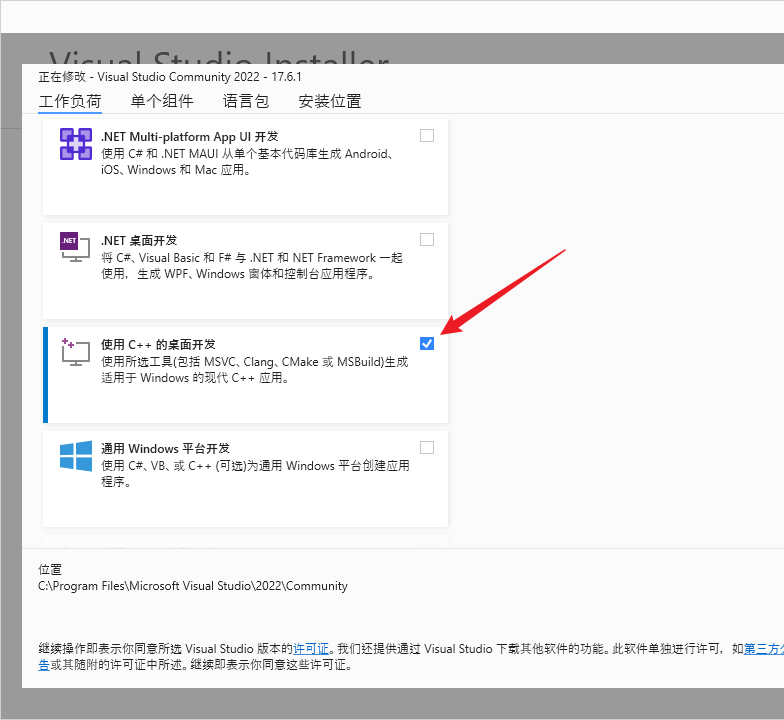

## 安装&配置CMake

没什么重要的配置，版本我下的是3.27-rc2，最新的就行

一路下一步, 直到这个页面
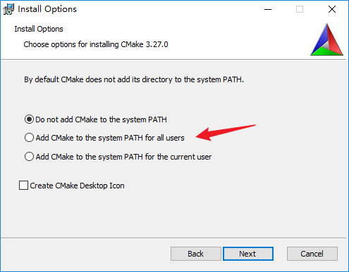

建议选择第二个，省去很多麻烦

安装完成，打开cmd，输入`cmake -version`，看看cmake环境变量是否正常
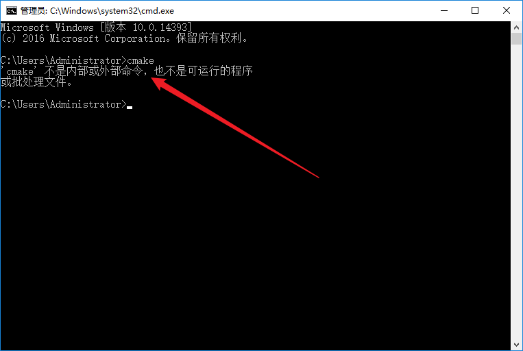
如果和我一样，显示不是内部或外部命令，就代表cmake环境变量不正常，需要手动添加cmake环境变量

右键 计算机 > 属性 > 高级系统设置 > 环境变量 > 系统变量 > Path

如果没有看到cmake字样代表环境变量缺失，需要手动添加环境变量   
进入你的cmake安装目录，我这里是默认路径，所以是C:\Program Files\CMake\bin    
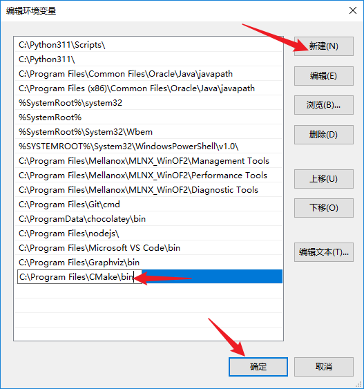
把这个路径添加到环境变量中，然后重启系统即可   

## 克隆版本库

在你要新建项目的位置，按住键盘上的shift，在空白处点击右键，然后在菜单中选择“在此处打开Powershell窗口”。  
然后，在powershell中输入`git clone https://github.com/LiteLDev/PluginTemplate-CPP.git`
git将开始从远程仓库下载插件模板。如果提示网络错误之类，打开开头推荐安装的watt toolkit挂上加速重试

## VScode配置
确保你以按前面要求安装了所需的vscode扩展，再阅读下面的教程  

使用vscode打开你的项目，新建一个`.vscode`文件夹

### 配置launch.json
在`.vscode`文件夹下，新建`launch.json`文件，并复制以下内容进去    
然后看注释修改两个地方   

```json
{
    "version": "0.2.0",
    "configurations": [
        {
            "name": "Build Plugin",
            // 注意修改  BDS路径
            "program": "C:\\Server\\Beta\\bedrock_server_mod.exe",
            "type": "cppvsdbg",
            "request": "launch",
            "args": [],
            "stopAtEntry": false,
            "cwd": "${workspaceRoot}",
            "environment": [],
            // 调试控制台  internalConsole使用VSC内置控制台  externalTerminal外部控制台
            "console": "externalTerminal",
            "preLaunchTask": "build",
            "logging": {
                "moduleLoad": false
            }
        },
        // 附加调试
        {
            "name": "(vsdbg) 附加",
            "type": "cppvsdbg",
            "request": "attach",
            "processId": "${command:pickProcess}",
            "logging": {
                "moduleLoad": false,
                "trace": true
            },
            // 注意修改  附加PDB
            "visualizerFile":"D:\\Repo\\test-c\\build\\Release\\plugin.pdb"
        }
    ]
}
```

### 配置tasks.json
在.vscode文件夹下，新建tasks.json文件，并复制以下内容进去    

```json
{
    "version": "2.0.0",
    "tasks": [
		{
			"type": "shell",
			"label": "cmake",
			"command": "cmake -B ./build ."
		},
		{
			"type": "shell",
			"label": "make",
			"command": "cmake --build ./build --config=Debug"
		},
		{
			"label": "build",
			"dependsOrder": "sequence",
			"dependsOn": [
				"cmake",
				"make"
			]
		}
	]
}
```

配置完以上两个文件，你的仓库目录应该是这样的
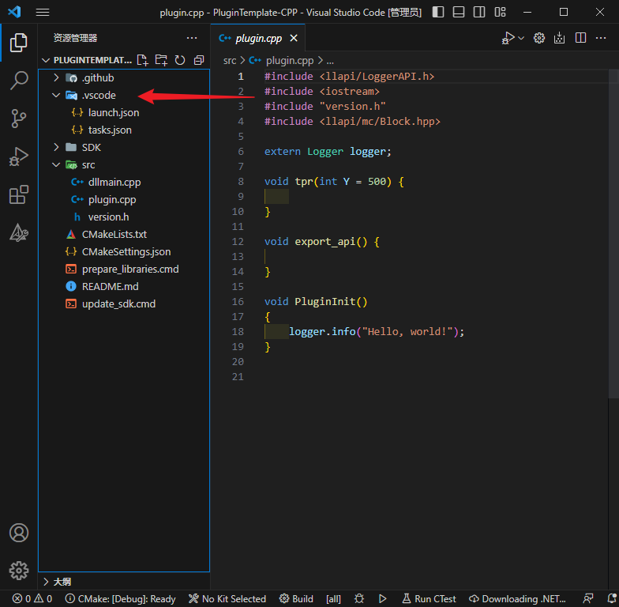

### 拉取更新SDK

在根目录找到update_sdk.cmd并运行一次

### 尝试调试

因为我的仓库都配置好了，懒的再新建仓库，所以copy了一下，做了个简易仓库，在下文中统一叫它仓库   

仓库绝对路径：D:\Repo\PluginTemplate-CPP   

vscode打开项目仓库，按道理，右下角会有一堆提示、报错、建议   
我们选择直接无视    

接着打开./src/plugin.cpp, 按F5开始调试   
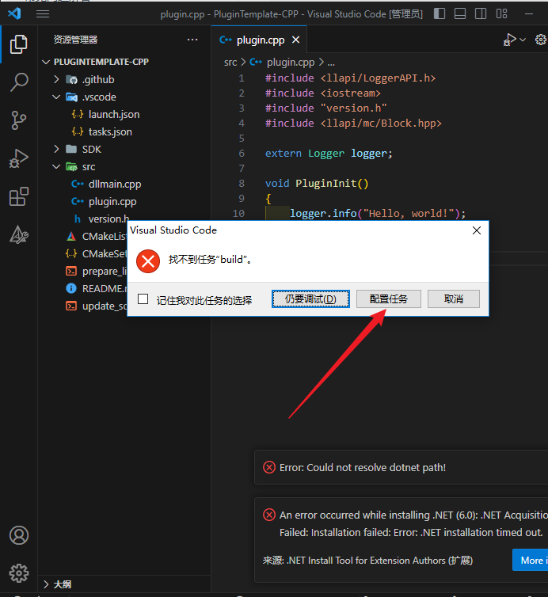  
意料之中的错误，为什么它会报错找不到任务build，那就要问微软了，这个是玄学     
跟着箭头点配置任务，接下来会打开这个页面  
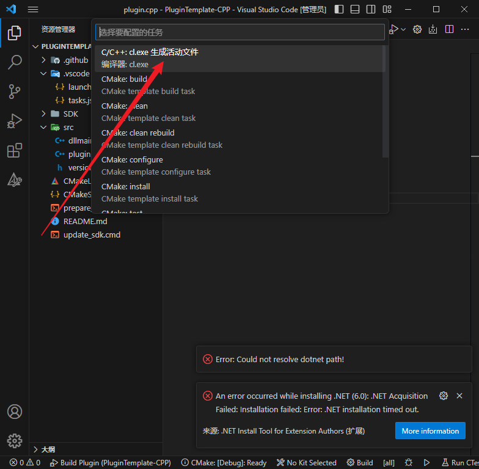  
选择cl调试, 然后vscode会跳转到我们配置好的tasks文件     
你会发现vscode自动在后面加上了它的内容，我们选择不需要，删掉  
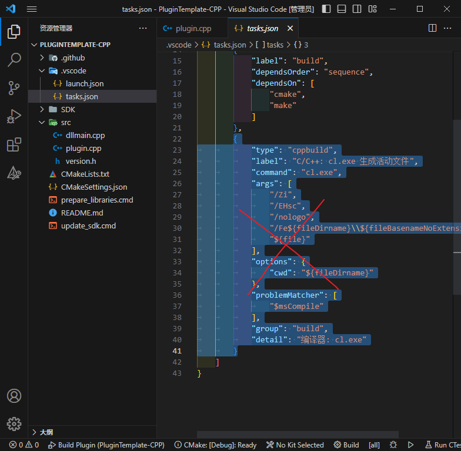  

> [!warning]
> tasks.json和launch.json都必须和上述内容一致(要改的除外)

接着再按F5，你会发现已经开始编译了
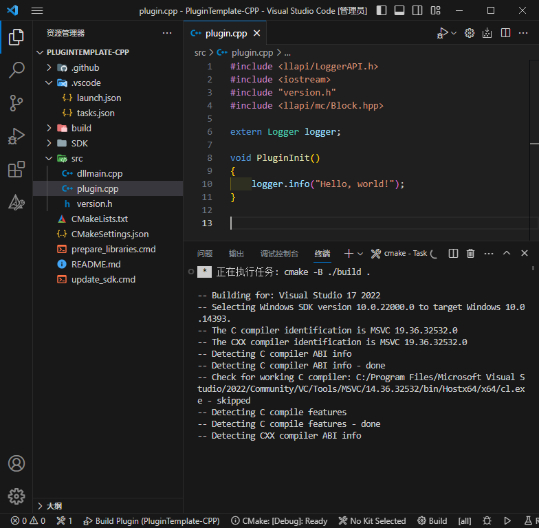
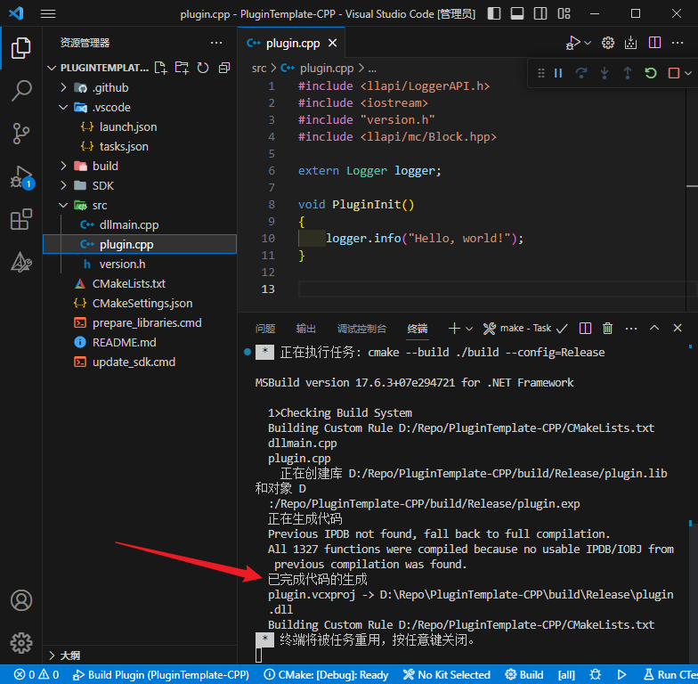
出现上述字样代表你的环境配置成功！

接着按照调试文件配置，会启动BDS
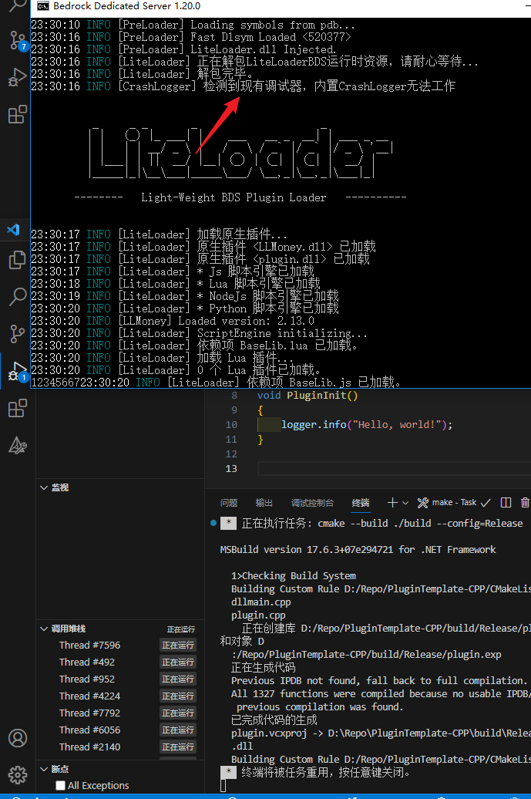
BDS输出 检测到现有调试器.....代表调试配置成功
接下来你可以在你的代码上打上断点，开始调试你的插件

当然，如果你不想F5启动BDS调试，只想编译，点击下方的Build按钮即可
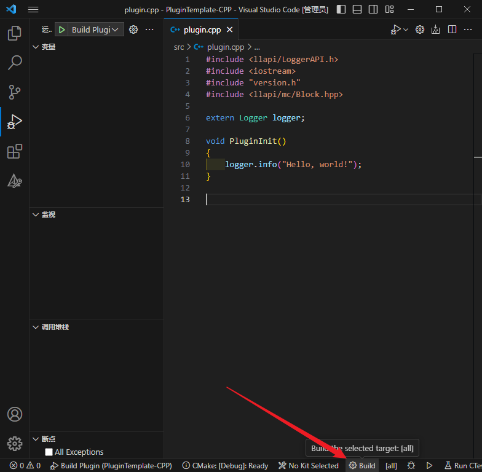

## 手动编译

其实编译很简单，就两个命令

```cmd
cmake -B ./build
cmake --build ./build --config=Release
```

根据这两个命令，我们可以写一个bat脚本
```bat
@echo off

echo SetConsole UTF-8
chcp 65001 >nul

echo. 
echo [Build] ./Build
echo. 

cmake -B ./Build

echo. 
echo [Buid] Plugin
echo. 

cmake --build ./build --config=Release

echo. 
echo [Buid] Success
echo. 

pause
```
将这个脚本放入仓库根目录下   
双击运行它   
```log

[Build] ./Build

-- Building for: Visual Studio 17 2022
-- Selecting Windows SDK version 10.0.22000.0 to target Windows 10.0.14393.
-- The C compiler identification is MSVC 19.36.32532.0
-- The CXX compiler identification is MSVC 19.36.32532.0
-- Detecting C compiler ABI info
-- Detecting C compiler ABI info - done
-- Check for working C compiler: C:/Program Files/Microsoft Visual Studio/2022/Community/VC/Tools/MSVC/14.36.32532/bin/Hostx64/x64/cl.exe - skipped
-- Detecting C compile features
-- Detecting C compile features - done
-- Detecting CXX compiler ABI info
-- Detecting CXX compiler ABI info - done
-- Check for working CXX compiler: C:/Program Files/Microsoft Visual Studio/2022/Community/VC/Tools/MSVC/14.36.32532/bin/Hostx64/x64/cl.exe - skipped
-- Detecting CXX compile features
-- Detecting CXX compile features - done
-- Configuring done (5.5s)
-- Generating done (0.1s)
-- Build files have been written to: D:/Repo/PluginTemplate-CPP/Build

[Buid] Plugin

MSBuild version 17.6.3+07e294721 for .NET Framework

  1>Checking Build System
  Building Custom Rule D:/Repo/PluginTemplate-CPP/CMakeLists.txt
  dllmain.cpp
  plugin.cpp
    正在创建库 D:/Repo/PluginTemplate-CPP/Build/Release/plugin.lib 和对象 D:/Repo/PluginTemplate-CPP
  /Build/Release/plugin.exp
  正在生成代码
  Previous IPDB not found, fall back to full compilation.
  All 1327 functions were compiled because no usable IPDB/IOBJ from previous compilation was
   found.
  已完成代码的生成
  plugin.vcxproj -> D:\Repo\PluginTemplate-CPP\Build\Release\plugin.dll
  Building Custom Rule D:/Repo/PluginTemplate-CPP/CMakeLists.txt

[Buid] Success

Press any key to continue . . .
```

编译生成的插件在仓库根目录下的./Build文件夹下    
注意: Release为正式版 用于发布   Debug为测试版  用于调试
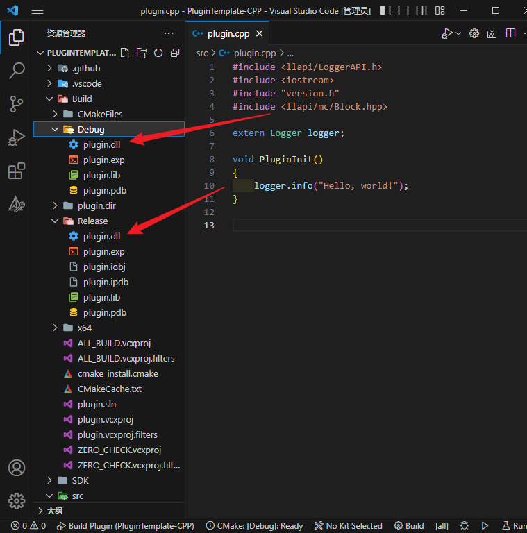

## 记录问题
23/6/14   cmake编译报错    
```log
  Building Custom Rule D:/Repo/TPR/CMakeLists.txt
LINK : fatal error C1047: 对象或库文件“D:\Repo\TPR\SDK\lib\SymDBHelper.lib”是使用与其他对象(如“plugin.dir\Debug\dllmain.obj”)不同的编译器版本创建的；请使用相同的编译
器重新生成所有对象和库 [D:\Repo\TPR\build\plugin.v
cxproj]
LINK : fatal error LNK1257: 代码生成失败 [D:\Repo\TPR\build\plugin.vcxproj]
```

解决方法  删除sdk/lib/bedrock开头的两个文件重试   
实在不行，重新拉取SDK   
